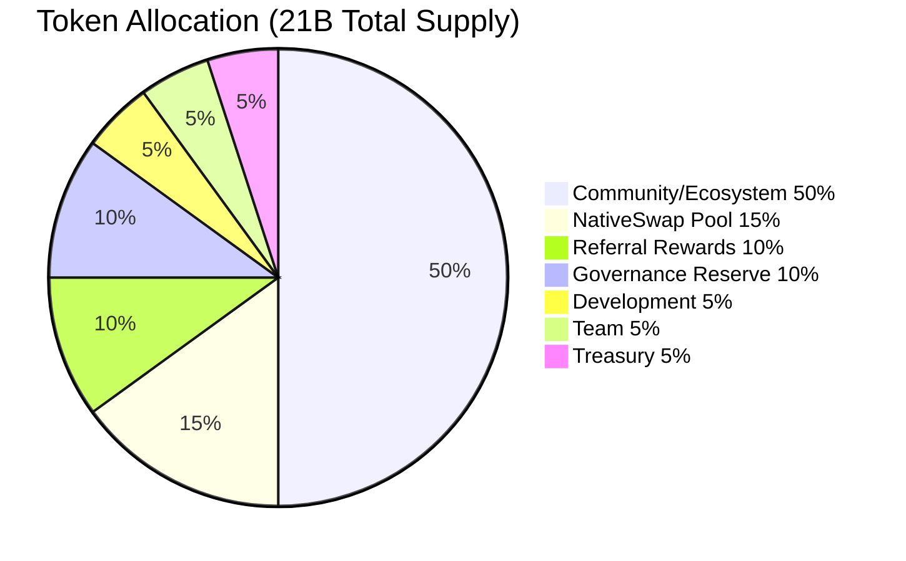

<p align="center">
  
</p>

<h1 align="center">$SCRIBE</h1>
<h3 align="center">Governance & Utility Token &mdash; Natively on Bitcoin L1</h3>

<p align="center">
  <strong>6 smart contracts. Zero bridges. Pure Bitcoin.</strong>
</p>

<p align="center">
  <a href="https://myscribe.org">MyScribe</a> &middot; <a href="https://scribe.myscribe.org">Dashboard</a> &middot; <a href="#contracts">Contract Docs</a> &middot; <a href="https://x.com/myscribebtc">@myscribebtc</a>
</p>

---

## What is $SCRIBE?

$SCRIBE is the OP-20 governance and utility token powering [MyScribe](https://myscribe.org), a Bitcoin-native social identity platform built on [OPNet](https://opnet.org). Your identity, your content, and your community all live permanently on Bitcoin L1. No bridges. No wrapped BTC. No sidechains.

This repo contains the **complete source code** for all 6 smart contracts deployed on Bitcoin mainnet via OPNet. Every line is open for review.

**Runtime:** `@btc-vision/btc-runtime@1.11.1`

---

## Token Parameters

| Parameter | Value |
|-----------|-------|
| Standard | OP-20 (OPNet, Bitcoin L1) |
| Name | MyScribe |
| Symbol | SCRIBE |
| Total Supply | 21,000,000,000 (21 billion) |
| Decimals | 2 |
| Transfer Tax | 3% &rarr; Referral Rewards |
| Community-Controlled | 85% |
| DEX | NativeSwap on Motoswap |

---

## Token Allocation

| Allocation | % | Tokens | Lock / Vesting |
|---|---|---|---|
| Referral Rewards | 10% | 2.10B | Tax destination (3% inflow) |
| NativeSwap Pool Seed | 15% | 3.15B | Seeded Motoswap DEX pool |
| Governance Reserve | 10% | 2.10B | Future vote: burn or add to pool |
| Community / Ecosystem | 50% | 10.50B | Governance-controlled (1 SCRIBE = 1 vote) |
| Development | 5% | 1.05B | 2-year linear vest, 3-month cliff |
| Team | 5% | 1.05B | 4-year vest, 1-year cliff |
| Treasury | 5% | 1.05B | 1-year linear vest, no cliff |
| **Total** | **100%** | **21.00B** | |

**85% community-controlled.** Only 10% to team (5%) and development (5%), both vested with cliffs.



---

## Architecture

```
+-------------------------------------------------------------+
|                     $SCRIBE Token Stack (v2)                 |
+-----------------+---------------------+---------------------+
|  ScribeToken    |  ScribeFaucet       |  ScribeRewards-     |
|                 |                     |  Treasury           |
|  21B supply     |  Community faucet   |                     |
|  3% tax         |  1,000 SCRIBE/claim |  Tax destination    |
|  Tax-exempt     |  6hr cooldown       |  Admin allocates    |
|  list           |  Pause/unpause      |  Users claim        |
+-----------------+---------------------+---------------------+
|  ScribeGovernance v3                                        |
|                                                             |
|  Token-weighted voting  .  1 SCRIBE = 1 vote                |
|  Configurable voting period (6-4320 blocks)                 |
|  Proposal create/vote/execute  .  Double-vote prevention    |
|  Reserve Pool (2.1B) + Community Pool (10.5B)               |
+-----------------+---------------------+---------------------+
|  ScribeVesting  |  ScribeTreasury     |                     |
|                 |                     |                     |
|  Dev: 2yr vest  |  1.05B SCRIBE       |  NativeSwap Pool    |
|  3mo cliff      |  1yr linear         |  ~3.12B seeded      |
|  Team: 4yr vest |  No cliff           |  Anti-bot 5 blocks  |
|  1yr cliff      |  Treasury wallet    |  Motoswap DEX       |
+-----------------+---------------------+---------------------+
|                    Bitcoin L1 (OPNet)                        |
+-------------------------------------------------------------+
```

---

<a id="contracts"></a>

## Contract Reference

### 1. ScribeToken &mdash; OP-20 with Transfer Tax

**`contracts/src/token/ScribeToken.ts`**

Standard OP-20 token with a configurable transfer tax on non-exempt transfers. Tax is sent to the Referral Rewards address. Deployer manages a tax-exempt list for protocol contracts.

| Function | Access | Description |
|----------|--------|-------------|
| `initialize()` | Owner | Mints 21B to deployer |
| `setRewardsAddress(addr)` | Owner | Points tax to referral contract + auto-exempts |
| `setTaxRate(bps)` | Owner | Set tax rate in basis points |
| `enableTax()` / `disableTax()` | Owner | Toggle transfer tax |
| `setTaxExempt(addr, bool)` | Owner | Add/remove from exempt list |
| `transfer(to, amount)` | Public | Standard transfer with tax |
| `burn(amount)` | Public | Permanently destroy tokens |

---

### 2. ScribeFaucet &mdash; Community Token Faucet

**`contracts/src/faucet/ScribeFaucet.ts`**

Free token distribution for community onboarding. Configurable claim amount and cooldown period.

| Function | Access | Description |
|----------|--------|-------------|
| `claim()` | Public | Claim free SCRIBE tokens |
| `setClaimAmount(amount)` | Owner | Configure tokens per claim |
| `setCooldown(blocks)` | Owner | Set cooldown between claims |
| `pause()` / `unpause()` | Owner | Toggle faucet |
| `faucetInfo()` | Public | Claim amount, cooldown, paused state |

---

### 3. ScribeRewardsTreasury &mdash; Referral Rewards Pool

**`contracts/src/rewards/ScribeRewardsTreasury.ts`**

Destination for the token's 3% transfer tax. Admin allocates rewards to individual users. Users call `claimRewards()` to pull their allocated tokens. Extends `ReentrancyGuard`.

| Function | Access | Description |
|----------|--------|-------------|
| `claimRewards()` | Public | Claim allocated rewards |
| `allocateReward(recipient, amount)` | Owner | Allocate rewards to user |
| `pause()` / `unpause()` | Owner | Toggle claims |
| `withdrawUnallocated(amount)` | Owner | Withdraw unallocated tokens |
| `getClaimable(account)` | Public | View allocated/claimed/pending |

---

### 4. ScribeGovernance v3 &mdash; Token-Weighted Voting with Configurable Period

**`contracts/src/governance/ScribeGovernance.ts`**

On-chain governance with token-weighted voting (1 SCRIBE = 1 vote). Manages two fund pools: Reserve (2.1B) and Community (10.5B). Configurable voting period with deployer-adjustable bounds.

| Function | Access | Description |
|----------|--------|-------------|
| `createProposal(pool, action, recipient, amount)` | Owner | Create transfer or burn proposal |
| `vote(proposalId, support)` | Public | Cast vote (weighted by SCRIBE balance) |
| `executeProposal(proposalId)` | Owner | Execute passed proposal |
| `setVotingPeriod(blocks)` | Owner | Set voting period (min 6, max 4320 blocks) |
| `getVotingPeriod()` | Public | Current voting period |
| `proposalInfo(id)` | Public | Full proposal details |
| `getState()` | Public | Pool balances + proposal count |

**Security:** Composite-key double-vote prevention. No quorum &mdash; any participation counts. Yes must exceed No. Voting period snapshotted per proposal at creation time. CEI pattern on all executions.

---

### 5. ScribeVesting &mdash; Team + Dev Token Vesting

**`contracts/src/vesting/ScribeVesting.ts`**

Two independent vesting schedules with cliffs and linear unlock, all block-based.

| Schedule | Amount | Cliff | Total Vest |
|----------|--------|-------|-----------|
| Development | 1.05B | 3 months (~12,960 blocks) | 2 years (~105,120 blocks) |
| Team | 1.05B | 1 year (~52,560 blocks) | 4 years (~210,240 blocks) |

| Function | Access | Description |
|----------|--------|-------------|
| `setDevWallet(addr)` / `setTeamWallet(addr)` | Owner | Set claim wallets |
| `startVesting()` | Owner | Start vesting clocks |
| `claimDev()` | Dev wallet | Claim vested dev tokens |
| `claimTeam()` | Team wallet | Claim vested team tokens |
| `devVestingInfo()` / `teamVestingInfo()` | Public | Vesting progress |

---

### 6. ScribeTreasury &mdash; Operational Treasury Vesting

**`contracts/src/treasury/ScribeTreasury.ts`**

Single-pool treasury vesting for operational partnerships. 1-year linear unlock with no cliff &mdash; tokens begin unlocking immediately after `startVesting()`. Extends `ReentrancyGuard`.

| Schedule | Amount | Cliff | Total Vest |
|----------|--------|-------|-----------|
| Treasury | 1.05B | None | 1 year (~52,560 blocks) |

| Function | Access | Description |
|----------|--------|-------------|
| `setTreasuryWallet(addr)` | Owner | Set claim wallet |
| `startVesting()` | Owner | Start vesting clock |
| `claim()` | Treasury wallet | Claim vested tokens |
| `vestingInfo()` | Public | Total/vested/claimed/claimable |

---

## Security

- All arithmetic uses **SafeMath** (no raw operators on u256)
- **Checks-Effects-Interactions** pattern on all external calls
- **ReentrancyGuard** on contracts with cross-contract token transfers
- **onlyDeployer** access control on all admin functions
- All **BytesWriter** buffer sizes verified against exact write counts
- Bounded loops only &mdash; no while loops, no unbounded iteration
- Block-based timing (`Blockchain.block.number`) &mdash; no miner-manipulable timestamps
- Audited against OPNet's Critical Runtime Vulnerability Patterns

---

## Deployed Addresses (Bitcoin Mainnet)

| Contract | Address |
|----------|---------|
| ScribeToken v2 | `0xaf299fd16ba81c022ce4cca2f179868192e6f2b8dda9a44a002d3716e135ca6a` |
| ScribeFaucet | `0x4e73e08f935498ce2d61c2303f45474e0efa70d5d9c72340fee63d3d3d8167ff` |
| NativeSwap Pool | `0xbaf131d22120efe459586eb9eda2590f78044851bfcda49365ed1c1dbc863ee4` |

ScribeRewardsTreasury, ScribeGovernance v3, ScribeVesting, and ScribeTreasury are deployed on testnet and pending mainnet deployment.

---

## Build

Requires [OPNet AssemblyScript toolchain](https://opnet.org):

```bash
cd contracts
npm install
npm run build:token
npm run build:faucet
npm run build:rewards
npm run build:governance
npm run build:vesting
npm run build:treasury
# or build all at once:
npm run build:all
```

Outputs WASM files to `contracts/build/`.

---

## Links

- **Website:** [myscribe.org](https://myscribe.org)
- **Dashboard:** [scribe.myscribe.org](https://scribe.myscribe.org)
- **Trade:** [Motoswap NativeSwap DEX](https://motoswap.org)
- **X:** [@myscribebtc](https://x.com/myscribebtc)
- **Telegram:** [MyScribe Community](https://t.me/+i6kJeFuWujk5Zjgx)
- **OPNet:** [opnet.org](https://opnet.org)

---

<p align="center"><em>Built on Bitcoin. No bridges. No sidechains. No algorithms. Just legends.</em></p>
