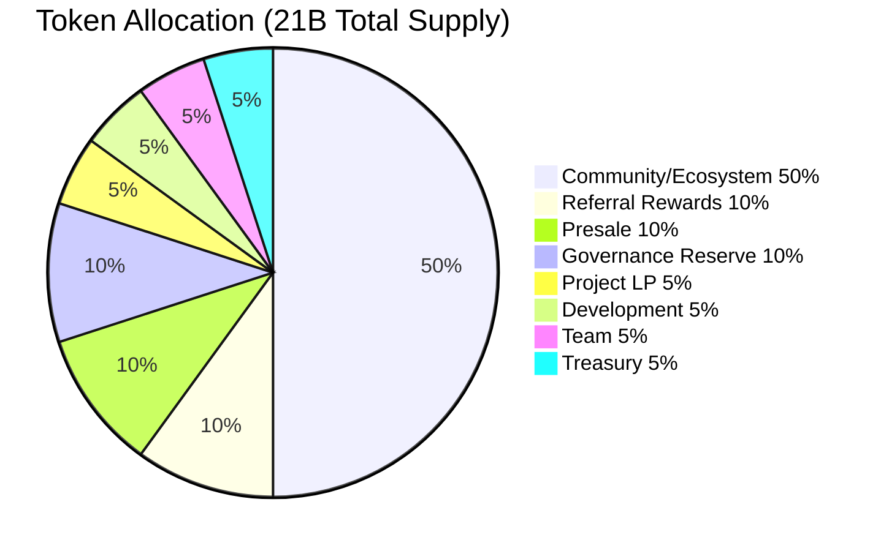
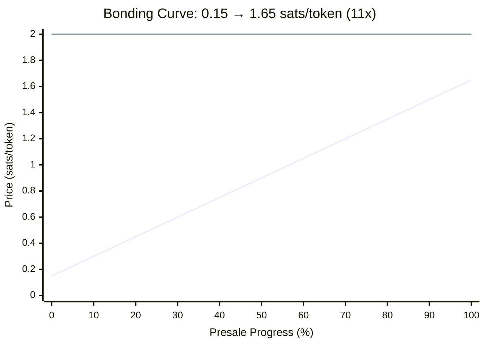

<p align="center">
  
</p>

<h1 align="center">$SCRIBE</h1>
<h3 align="center">Governance & Utility Token &mdash; Natively on Bitcoin L1</h3>

<p align="center">
  <strong>4 smart contracts. Zero bridges. Pure Bitcoin.</strong>
</p>

<p align="center">
  <a href="https://myscribe.org">MyScribe</a> &middot; <a href="https://presale.myscribe.org">Presale</a> &middot; <a href="#contracts">Contract Docs</a> &middot; <a href="https://x.com/myscribebtc">@myscribebtc</a>
</p>

---

## What is $SCRIBE?

$SCRIBE is the OP-20 governance and utility token powering [MyScribe](https://myscribe.org), a Bitcoin-native social identity platform built on [OPNet](https://opnet.org). Your identity, your content, and your community all live permanently on Bitcoin L1. No bridges. No wrapped BTC. No sidechains.

This repo contains the **complete source code** for all 4 smart contracts deployed on Bitcoin mainnet via OPNet. Every line is open for review.

---

## Token Parameters

| Parameter | Value |
|-----------|-------|
| Standard | OP-20 (OPNet, Bitcoin L1) |
| Total Supply | 21,000,000,000 (21 billion) |
| Decimals | 2 |
| Transfer Tax | 3% &rarr; Referral Rewards |
| Community-Controlled | 90% |

---

## Token Allocation

| Allocation | % | Tokens | Lock / Vesting |
|---|---|---|---|
| Referral Rewards | 10% | 2.10B | Pre-funded, replenished by 3% tax |
| Bonding Curve Presale | 10% | 2.10B | 30-day linear vesting (trustless, built into presale contract) |
| Project-Owned LP | 5% | 1.05B | Paired with BTC, locked ~6 years on Motoswap |
| Governance Reserve | 10% | 2.10B | Presale vote: burn or liquidity mining |
| Community / Ecosystem | 50% | 10.50B | Governance-controlled (1 SCRIBE = 1 vote) |
| Development | 5% | 1.05B | 2-year linear vest, 3-month cliff |
| Team | 5% | 1.05B | 4-year vest, 1-year cliff |
| Treasury | 5% | 1.05B | 6-month lock, then governance |
| **Total** | **100%** | **21.00B** | |

**90% community-controlled.** Only 10% to team (5%) and development (5%), both aggressively vested with cliffs.



---

## Bonding Curve

The presale uses integral pricing along a linear bonding curve. Early buyers get the best price.



| Tier | Sats/Token | Gain at DEX (2.00) |
|------|-----------|-------------------|
| First buyer | 0.15 | **+1,233%** |
| Midpoint | 0.90 | **+122%** |
| Last buyer | 1.65 | **+21%** |
| DEX Launch | 2.00 | -- |

---

## Architecture

```
┌─────────────────────────────────────────────────────────────┐
│                     $SCRIBE Token Stack                      │
├─────────────────┬─────────────────────┬─────────────────────┤
│  ScribeToken    │  ScribePresale      │  ScribeTreasury     │
│                 │                     │                     │
│  21B supply     │  Bonding curve      │  Community  10.50B  │
│  3% tax         │  0.15→1.65 sats/tok │  Team        1.05B  │
│  Tax-exempt     │  Inline vote        │  Dev         1.05B  │
│  list           │  30-day vesting     │  Treasury    1.05B  │
│                 │  Reserve burn/LM    │                     │
│                 │  BTC verification   │  Governance-gated   │
├─────────────────┴─────────────────────┴─────────────────────┤
│                     ScribeGovernance                         │
│                                                             │
│  Token-weighted voting  ·  1 SCRIBE = 1 vote                │
│  Proposal create/vote/execute  ·  Double-vote prevention     │
│  Quorum: 2.1B  ·  Cross-contract execution                  │
├─────────────────────────────────────────────────────────────┤
│                    Bitcoin L1 (OPNet)                         │
└─────────────────────────────────────────────────────────────┘
```

---

<a id="contracts"></a>

## Contract Reference

### 1. ScribeToken &mdash; OP-20 with Transfer Tax

**`contracts/token/ScribeToken.ts`**

Standard OP-20 token with a 3% transfer tax on non-exempt transfers. Tax is sent to the Referral Rewards address (set post-deployment). Deployer can manage a tax-exempt list for protocol contracts.

| Function | Access | Description |
|----------|--------|-------------|
| `initialize()` | Owner | Mints 21B to deployer |
| `setRewardsAddress(addr)` | Owner | Points 3% tax to referral contract |
| `setTaxExempt(addr, bool)` | Owner | Add/remove from exempt list |
| `transfer(to, amount)` | Public | Standard transfer with 3% tax |
| `burn(amount)` | Public | Permanently destroy tokens |

**Tax logic:** If neither sender nor receiver is tax-exempt and a rewards address is set, 3% of each transfer is redirected to the rewards address. If no rewards address is set, transfers are tax-free.

---

### 2. ScribePresale &mdash; Bonding Curve + Vote + Vesting + Reserve

**`contracts/presale/ScribePresale.ts`**

The most feature-rich contract. Handles the entire presale lifecycle in a single trustless contract:

**Bonding Curve Pricing:**
- Linear curve: 0.15 &rarr; 1.65 sats/token (11x spread)
- Integral pricing for fair continuous calculation
- BTC payment verified from transaction outputs to collection address
- Per-wallet 1 BTC contribution cap

**Inline Governance Vote:**
- Each purchase is a vote event: BURN (1), LIQUIDITY MINING (2), or ABSTAIN (0)
- Vote power = tokens received in that purchase
- Same wallet can buy multiple times with different votes
- Live results via `getVoteCounts()`

**Built-in 30-Day Vesting:**
- After presale ends, admin calls `startVesting()`
- Buyers call `claim()` for linear 30-day unlock (~3.3%/day)
- Reads allocations directly from `buyerTokensMap` &mdash; fully trustless, no manual loading

**Governance Reserve Execution:**
- Contract holds 4.2B total: 2.1B for sale + 2.1B governance reserve
- After presale ends: `executeBurn()` destroys 2.1B (supply &rarr; 18.9B) OR `executeLiquidityMining(farmAddr)` transfers 2.1B to LP farming
- Mutual exclusion enforced &mdash; one path locks out the other

| Function | Access | Description |
|----------|--------|-------------|
| `configure(token, treasury, lp, collectionKey, collectionAddr)` | Owner | Set contract references |
| `start()` / `end()` | Owner | Activate/deactivate presale |
| `buy(vote)` | Public | Purchase tokens + cast vote |
| `startVesting()` | Owner | Begin 30-day vesting (requires presale ended) |
| `claim()` | Public | Claim vested tokens |
| `executeBurn()` | Owner | Burn 2.1B reserve tokens |
| `executeLiquidityMining(farmAddr)` | Owner | Transfer 2.1B to farming contract |
| `withdrawUnsold(recipient)` | Owner | Withdraw unsold presale tokens (one-time) |
| `currentPrice()` | Public | Current bonding curve price |
| `presaleInfo()` | Public | Sale stats (totalSold, totalBtc, active, ended) |
| `getVoteCounts()` | Public | Burn vs LM vote power |
| `claimable(account)` | Public | Pending vested tokens |
| `vestingInfo(account)` | Public | Full vesting breakdown |
| `reserveStatus()` | Public | Reserve amount, execution state, vote winner |

---

### 3. ScribeGovernance &mdash; Token-Weighted Voting

**`contracts/governance/ScribeGovernance.ts`**

On-chain governance with token-weighted voting. 1 SCRIBE = 1 vote. Proposals target specific contracts with encoded function calls.

| Function | Access | Description |
|----------|--------|-------------|
| `createProposal(target, selector, recipient, amount, durationBlocks)` | Owner | Create new proposal |
| `vote(proposalId, support)` | Public | Cast vote (weighted by SCRIBE balance) |
| `executeProposal(proposalId)` | Owner | Execute passed proposal via cross-contract call |
| `proposalCount()` | Public | Total proposals created |

**Security:** Bitmap-based double-vote prevention. Quorum requirement of 2.1B votes. Yes must exceed No for passage. Voting period enforced by block number.

---

### 4. ScribeTreasury &mdash; Vested Fund Management

**`contracts/treasury/ScribeTreasury.ts`**

Holds 13.65B SCRIBE across four allocation buckets, each with independent access controls and vesting schedules.

| Bucket | Amount | Access | Schedule |
|--------|--------|--------|----------|
| Community/Ecosystem | 10.50B | Governance only | Immediate (governance vote required) |
| Team | 1.05B | Team wallet | 4-year vest, 1-year cliff |
| Development | 1.05B | Dev wallet | 2-year vest, 3-month cliff |
| Treasury | 1.05B | Governance only | 6-month lock, then governance |

| Function | Access | Description |
|----------|--------|-------------|
| `setTGE()` | Owner | Start all vesting clocks |
| `claimTeam()` | Team wallet | Claim vested team tokens |
| `claimDev()` | Dev wallet | Claim vested dev tokens |
| `releaseCommunityFunds(recipient, amount)` | Governance only | Release community funds |
| `releaseTreasuryFunds(recipient, amount)` | Governance only | Release treasury funds (after lock) |
| `getAllocations()` | Public | View all bucket balances and states |

---

## Security

- All arithmetic uses **SafeMath** (no raw operators on u256)
- **Checks-Effects-Interactions** pattern on all external calls
- **onlyDeployer** access control on all admin functions
- All **BytesWriter** buffer sizes verified against exact write counts
- Bounded loops only (max 128 iterations in u256sqrt)
- No while loops, no unbounded iteration
- Audited against OPNet's 11 Critical Runtime Vulnerability Patterns &mdash; all clear

---

## Deployed Addresses (Bitcoin Mainnet)

| Contract | Address |
|----------|---------|
| ScribeToken | `0x09676cf6e93d0193ae6a6bfaeb6bcf820afd7d76bbe27c465d69b77471a4dcf2` |
| ScribePresale | `0xb17f32914c530b7a91b2119bee2164867950dfbbc27221089baef36adefdc226` |
| ScribeGovernance | `0xa96ca19554c91f1171a46f1fbbb4feff4c85225082c89318d921dccb7c39540b` |
| ScribeTreasury | `0xf554238d2b63facd73d9763c5bb67962d1ff19e01dc803444c13b1d963e5e314` |

---

## Build

Requires [OPNet AssemblyScript toolchain](https://opnet.org):

```bash
cd contracts
npm install
npm run build:token
npm run build:presale
npm run build:governance
npm run build:treasury
```

Outputs WASM files to `contracts/build/`.

---

## Links

- **Website:** [myscribe.org](https://myscribe.org)
- **Presale:** [presale.myscribe.org](https://presale.myscribe.org)
- **X:** [@myscribebtc](https://x.com/myscribebtc)
- **Telegram:** [MyScribe Community](https://t.me/+i6kJeFuWujk5Zjgx)
- **OPNet:** [opnet.org](https://opnet.org)

---

<p align="center"><em>Built on Bitcoin. No bridges. No sidechains. No algorithms. Just legends.</em></p>
